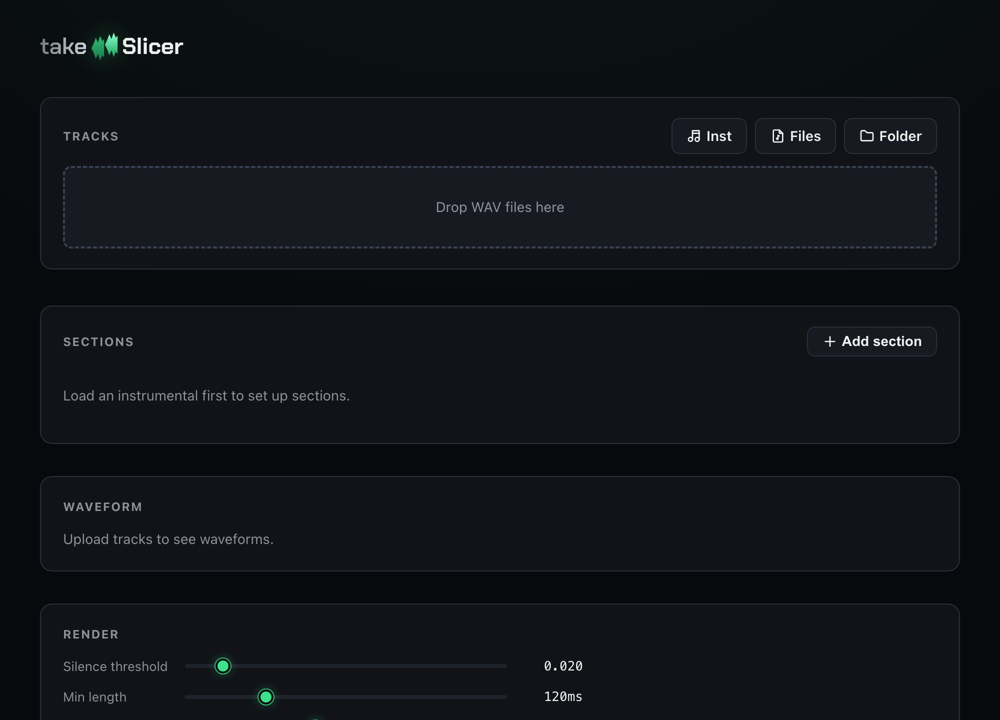

<div align="center">


<br/>

**Automate the tedious prep work before vocal comping — slice, name, and organize your takes.**

[](https://www.electronjs.org/)
[](https://react.dev/)
[](https://www.typescriptlang.org/)
[](https://electron-vite.org/)
[](LICENSE)


<br/>

**English** · [한국어](README.ko.md) · [日本語](README.ja.md)

</div>

---

## What is this?

Recording sessions leave you with a messy pile of vocal takes — multiple tracks, doubles, harmonies, and takes scattered across the timeline. Before you can comp, you have to cut each section, name it, and organize it **by hand**.

**takeSlicer does that cutting, naming, and foldering automatically** — so you jump straight to comping in your DAW (FL Studio, etc.). The comping itself stays in your DAW; takeSlicer just removes the grunt work around it.

<div align="center">

</div>

## ✨ Features

- 🎚 **Section-based slicing** — define your song sections by time, and every take is sliced to match.
- 🔇 **Silence-aware** — sections with no audio in a take are skipped automatically (tunable threshold / min-length / tail).
- 🎯 **0-origin render** — each slice is rendered from `0:00` with the audio masked in place, so it drops back onto the correct spot in your DAW timeline.
- 🌊 **DAW-style waveform** — stacked track lanes, section overlays, spacebar playback, `⌘`+scroll zoom, sharp at any zoom (windowed rendering).
- 👁 **Split preview** — expand any track to see exactly how it will be sliced, per section.
- 📁 **Organized output** — per-section folders, consistent naming, optional `.zip`.

## 🛠 How it works

1. **Define sections** — enter each song section (Intro, Verse A, Pre-Chorus, Chorus…) with its start/end time. You know your own timing, so no reference track needed.
2. **Upload takes** — drop in all the recorded WAV files for the song.
3. **Verify** — see each take's waveform with your section boundaries overlaid; confirm the sections line up and which tracks have audio where.
4. **Render** — for every *section × take*, takeSlicer slices out the tracks that actually contain audio and saves them into per-section folders.

### Output

```
Chorus/
  Chorus01vocal_main.wav
  Chorus02vocal_harmony.wav
Verse_A/
  Verse_A01vocal_main.wav
  …
```

- **Naming**: `{section}{NN}{originalFileName}.wav` — the original file name keeps doubles / harmonies distinct.
- **Rendered from 0:00** — each slice keeps the song's start point, so dragging it back into your DAW snaps to the correct timeline position. The clip runs from `0:00` to where the section's audio ends, plus a short tail.
- **Silent tracks skipped** — per section, via an RMS threshold with knobs for breaths / reverb tails.

## ⚙️ Tech stack

**Electron** (main / renderer / preload) · **React** + **TypeScript** · **electron-vite** · **Web Audio API** (native-rate decode, offline render) · **Canvas 2D** (windowed waveform) · **JSZip**.

## 🚀 Development

```bash
npm install      # install deps
npm run dev      # launch the app with HMR
npm run typecheck
```

### Build

```bash
npm run build:mac     # macOS
npm run build:win     # Windows
npm run build:linux   # Linux
```

## 📄 License

[MIT](LICENSE)

<div align="center">
<sub>Built for producers who burn out organizing scattered recording tracks before they even get to comp.</sub>
</div>
